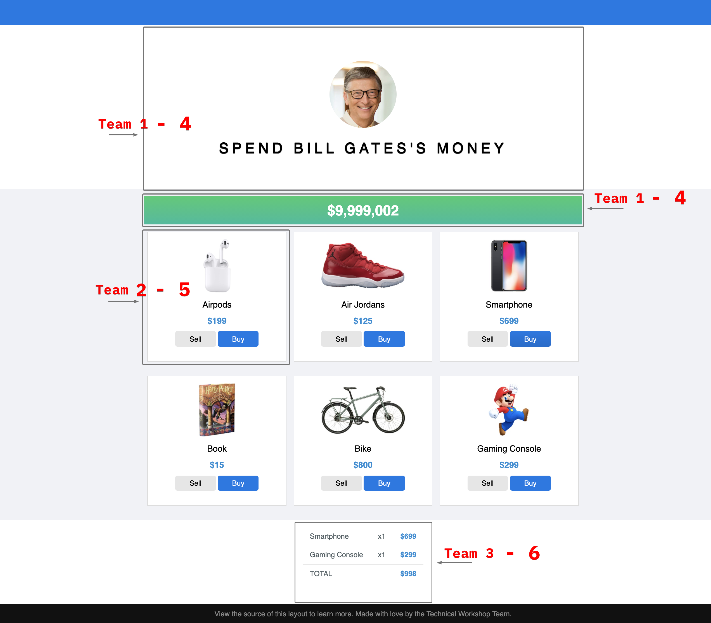

# MICRO-FRONTEND

This application is built with micro frontend approach in which a front-end app is decomposed into individual “microapps” working loosely together.  
In order to understand clearly the application, you should take a look the workshop slide [here](https://docs.google.com/presentation/d/15Hme2vXkNrUYNverqiYGxAr4MhozlDGTDNKyxdwOc_s/edit?usp=sharing)

## Features
Bill Gates is one of billionaires in the world. He's very rich. He has a lot of money.  
For that reason, today we will together help him spent his money on our application which following details:

1. Display Bill remaining money amount after buy / sell some products.
2. Display a list of products, each product should have buy / sell action.
3. Show and update the receipt on every buy / sell action.
4. Enable / disable buy button of any product which has unit price > remaining money amount.

Inspired by https://neal.fun/spend/  

## Demos
* Fragment wallet (Team 1): [--> View team 1 sandbox](https://aavn-ct-workshop.github.io/micro-frontend-team-one/sandbox.html)
* Fragment product item (Team 2): [--> View team 2 sandbox](https://aavn-ct-workshop.github.io/micro-frontend-team-two/sandbox.html)
* Fragment receipt (Team 3): [--> View team 3 sandbox](https://aavn-ct-workshop.github.io/micro-frontend-team-three/sandbox.html)
* Integrated application: [--> View integrated app](https://aavn-ct-workshop.github.io/micro-frontend/application/index.html)

## How to run app in local
To run the integrated app in local,  
you must have 3 additional repositories need to check out: `micro-frontend-team-one`, `micro-frontend-team-two` and `micro-frontend-team-three`.  
Then simply run `docker-compose up --build`

## Contributors
<table>
  <tr>
    <td align="center"><a href="https://github.com/dieuph"> <b>Dieu Pham</b></a> </td>
    <td align="center"><a href="https://github.com/tai-tran-tan"> <b>Tai Tran</b></a> </td>
    <td align="center"><a href="https://github.com/tshen-dev"> <b>Hen Tran</b></a> </td>
    <td align="center"><a href="https://github.com/nmanhhung1707"> <b>Hung Nguyen</b></a> </td>
    <td align="center"><a href="https://github.com/pnqphong"> <b>Phong Pham</b></a> </td>
    <td align="center"><a href="https://github.com/hgky95"> <b>Ky Huynh</b></a> </td>
    <td align="center"><a href="https://github.com/fluwins"> <b>Tai Tran Thien</b></a> </td>
    <td align="center"><a href="https://github.com/bkimtho"> <b>Tho Bui</b></a> </td>
  </tr>
</table>
