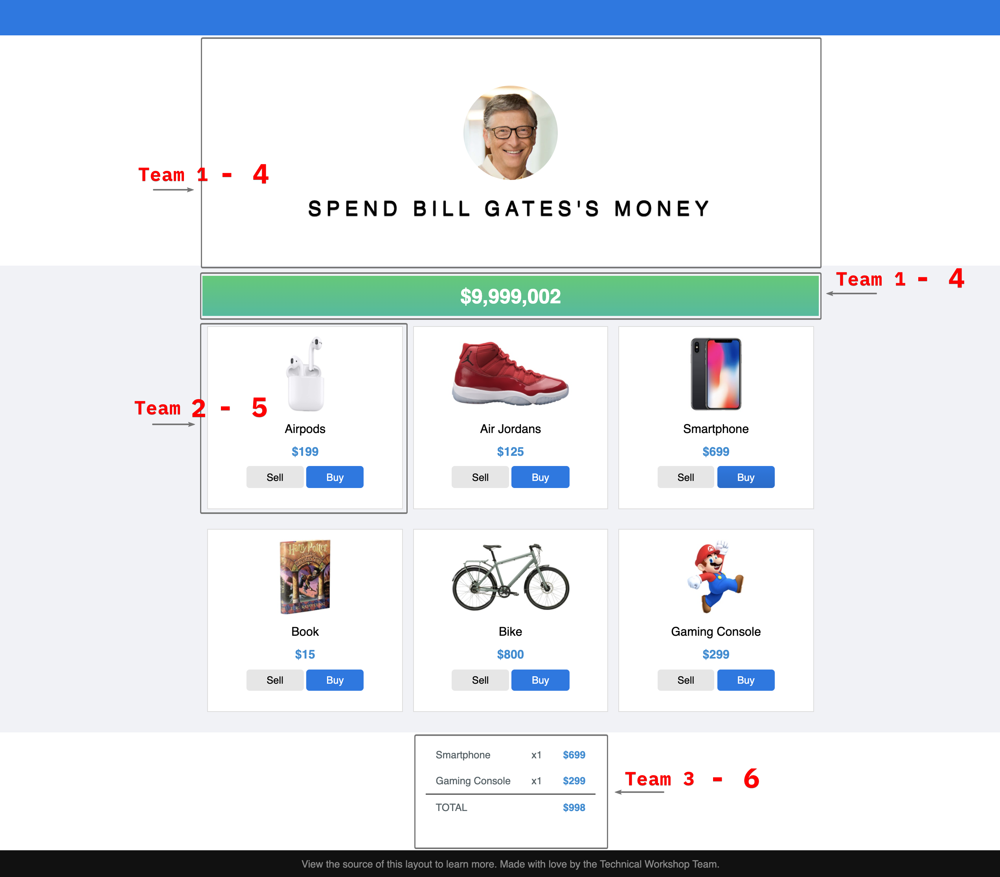

# Technical Workshop Challenge (Team 1)

**Topic**: Micro Frontend  
**Host**: Axon Active Can Tho - Technical Workshop Team  
**Date**: 10 - 11 December, 2020  

## Team Members

1. Huỳnh Gia Kỳ
2. La Ngọc Nguyên
3. Nguyễn Quang Minh
4. Nguyễn Lê Hiển Minh

## Team Account

|   |   |
| - | - |
| **Git account** |  techworkshopteam1 / 2nY$m_3F
| **Team email** | techshopteam1@gmail.com / KCt9Gd8SM$6yT
| **Repository** | https://github.com/aavn-ct-workshop/micro-frontend-team-one https://github.com/aavn-ct-workshop/micro-frontend |
| **Main branch** | team-1 |

## Application

https://neal.fun/spend/

## General Requirements

Bill Gates is one of billionaires in the world. He's very rich. He has a lot of money. For that reason, today we will together help him spent his money on our application.

As the workshop organizer, we want to build an application with ONE main features is sell / buy the product which will have some requirements:
1. Display Bill remaining money amount after _buy / sell_ some products.
2. Display a list of products, each product should have _buy / sell_ action.
3. Show and update the receipt on every _buy / sell_ action.
4. Enable / disable buy button of any product which has unit price > remaining money amount.

## Team Requirements

1. Build a fragment to display application banner.
2. Build a fragment to display remaning money amount, which will be updated when recept total change.

## Team Meeting Notes

#### 1. In/Out Events

...

...

...

#### 2. Custom Elements

...

...

...

#### 3. Sandboxs

...

...

...

#### 4. Integration

...

...

...

# Technical Workshop Challenge (Team 2)

**Topic**: Micro Frontend  
**Host**: Axon Active Can Tho - Technical Workshop Team  
**Date**: 10 - 11 December, 2020

## Team Members

1. Nguyễn Mạnh Hùng
2. Đinh Minh Ngộ
3. Nguyễn Nguyên Bách
4. Nguyễn Chí Mạnh

## Team Account

|   |   |
| - | - |
| **Git account** |  techworkshopteam2 / AeT6T#9f
| **Team email** | tech.shopteam1@gmail.com / KCt9Gd8SM$6yT
| **Repository** | https://github.com/aavn-ct-workshop/micro-frontend-team-two |
| **Main branch** | team-2 |

## Application

https://neal.fun/spend/

## General Requirements

Bill Gates is one of billionaires in the world. He's very rich. He has a lot of money. For that reason, today we will together help him spent his money on our application.

As the workshop organizer, we want to build an application with ONE main features is sell / buy the product which will have some requirements:
1. Display Bill remaining money amount after _buy / sell_ some products.
2. Display a list of products, each product should have _buy / sell_ action.
3. Show and update the receipt on every _buy / sell_ action.
4. Enable / disable buy button of any product which has unit price > remaining money amount.

## Team Requirements

1. Build a fragment to display a product item with sell / buy button, buy button must be disabled when remaining money amount < product unit price.

## Team Meeting Notes

#### 1. In/Out Events

...

...

...

#### 2. Custom Elements

...

...

...

#### 3. Sandboxs

...

...

...

#### 4. Integration

...

...

...

# Technical Workshop Challenge (Team 3)

**Topic**: Micro Frontend  
**Host**: Axon Active Can Tho - Technical Workshop Team  
**Date**: 10 - 11 December, 2020

## Team Members

1. Phạm Nguyễn Quang Phong
2. Nguyễn Anh Vũ
3. Tô Tuấn Linh
4. Phan Thành Trung

## Team Account

|   |   |
| - | - |
| **Git account** |  techworkshopteam3 / W+G6C+s9
| **Team email** | tech.shop.team1@gmail.com / KCt9Gd8SM$6yT
| **Repository** | https://github.com/aavn-ct-workshop/micro-frontend-team-three |
| **Main branch** | team-3 |

## Application

https://neal.fun/spend/

## General Requirements

Bill Gates is one of billionaires in the world. He's very rich. He has a lot of money. For that reason, today we will together help him spent his money on our application.

As the workshop organizer, we want to build an application with ONE main features is sell / buy the product which will have some requirements:
1. Display Bill remaining money amount after _buy / sell_ some products.
2. Display a list of products, each product should have _buy / sell_ action.
3. Show and update the receipt on every _buy / sell_ action.
4. Enable / disable buy button of any product which has unit price > remaining money amount.

## Team Requirements

1. Build a fragment to display receipt with total value. Receipt must be updated when sell or buy a product.

## Team Meeting Notes

#### 1. In/Out Events

...

...

...

#### 2. Custom Elements

...

...

...

#### 3. Sandboxs

...

...

...

#### 4. Integration

...

...

...

# Technical Workshop Challenge (Team 4)

**Topic**: Micro Frontend  
**Host**: Axon Active Can Tho - Technical Workshop Team  
**Date**: 10 - 11 December, 2020  

## Team Members

1. Trần Tấn Tài
2. Lục Thanh Giang
3. Trần Đức Tín
4. Nguyễn Thành Đô

## Team Account

|   |   |
| - | - |
| **Git account** |  techworkshopteam4 / rVL8j_7M
| **Team email** | techshopteam4@gmail.com / 9r$AZPhMy_f-nc6A
| **Repository** | https://github.com/aavn-ct-workshop/micro-frontend-team-one https://github.com/aavn-ct-workshop/micro-frontend |
| **Main branch** | team-4 |

## Application

https://neal.fun/spend/

## General Requirements

Bill Gates is one of billionaires in the world. He's very rich. He has a lot of money. For that reason, today we will together help him spent his money on our application.

As the workshop organizer, we want to build an application with ONE main features is sell / buy the product which will have some requirements:
1. Display Bill remaining money amount after _buy / sell_ some products.
2. Display a list of products, each product should have _buy / sell_ action.
3. Show and update the receipt on every _buy / sell_ action.
4. Enable / disable buy button of any product which has unit price > remaining money amount.

## Team Requirements

1. Build a fragment to display application banner.
2. Build a fragment to display remaning money amount, which will be updated when recept total change.

## Team Meeting Notes

#### 1. In/Out Events

...

...

...

#### 2. Custom Elements

...

...

...

#### 3. Sandboxs

...

...

...

#### 4. Integration

...

...

...

# Technical Workshop Challenge (Team 5)

**Topic**: Micro Frontend  
**Host**: Axon Active Can Tho - Technical Workshop Team  
**Date**: 10 - 11 December, 2020

## Team Members

1. Trần Thiện Tài
2. Nguyễn Ngọc Hiển
3. Huỳnh Thị Phi Yến
4. Nguyễn Minh Lý

## Team Account

|   |   |
| - | - |
| **Git account** |  techworkshopteam5 / d&n6mQ?v
| **Team email** | techshopteam2@gmail.com / %ZFtkL9B=^A^Q
| **Repository** | https://github.com/aavn-ct-workshop/micro-frontend-team-two |
| **Main branch** | team-5 |

## Application

https://neal.fun/spend/

## General Requirements

Bill Gates is one of billionaires in the world. He's very rich. He has a lot of money. For that reason, today we will together help him spent his money on our application.

As the workshop organizer, we want to build an application with ONE main features is sell / buy the product which will have some requirements:
1. Display Bill remaining money amount after _buy / sell_ some products.
2. Display a list of products, each product should have _buy / sell_ action.
3. Show and update the receipt on every _buy / sell_ action.
4. Enable / disable buy button of any product which has unit price > remaining money amount.

## Team Requirements

1. Build a fragment to display a product item with sell / buy button, buy button must be disabled when remaining money amount < product unit price.

## Team Meeting Notes

#### 1. In/Out Events

...

...

...

#### 2. Custom Elements

...

...

...

#### 3. Sandboxs

...

...

...

#### 4. Integration

...

...

...

# Technical Workshop Challenge (Team 6)

**Topic**: Micro Frontend  
**Host**: Axon Active Can Tho - Technical Workshop Team  
**Date**: 10 - 11 December, 2020

## Team Members

1. Bùi Thị Kim Tho
2. Trương Mạnh Tiến
3. Nguyễn Phúc Nhân
4. Võ Hoàng Gia

## Team Account

|   |   |
| - | - |
| **Git account** |  techworkshopteam6 / vR9V@5g!
| **Team email** | tech.shopteam2@gmail.com / %ZFtkL9B=^A^Q
| **Repository** | https://github.com/aavn-ct-workshop/micro-frontend-team-three |
| **Main branch** | team-6 |

## Application

https://neal.fun/spend/

## General Requirements

Bill Gates is one of billionaires in the world. He's very rich. He has a lot of money. For that reason, today we will together help him spent his money on our application.

As the workshop organizer, we want to build an application with ONE main features is sell / buy the product which will have some requirements:
1. Display Bill remaining money amount after _buy / sell_ some products.
2. Display a list of products, each product should have _buy / sell_ action.
3. Show and update the receipt on every _buy / sell_ action.
4. Enable / disable buy button of any product which has unit price > remaining money amount.

## Team Requirements

1. Build a fragment to display receipt with total value. Receipt must be updated when sell or buy a product.

## Team Meeting Notes

#### 1. In/Out Events

...

...

...

#### 2. Custom Elements

...

...

...

#### 3. Sandboxs

...

...

...

#### 4. Integration

...

...

...

